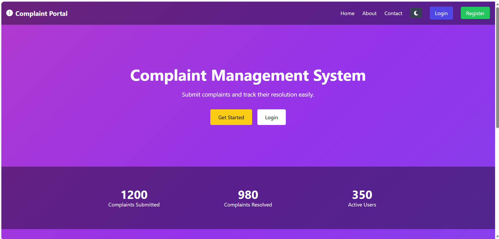
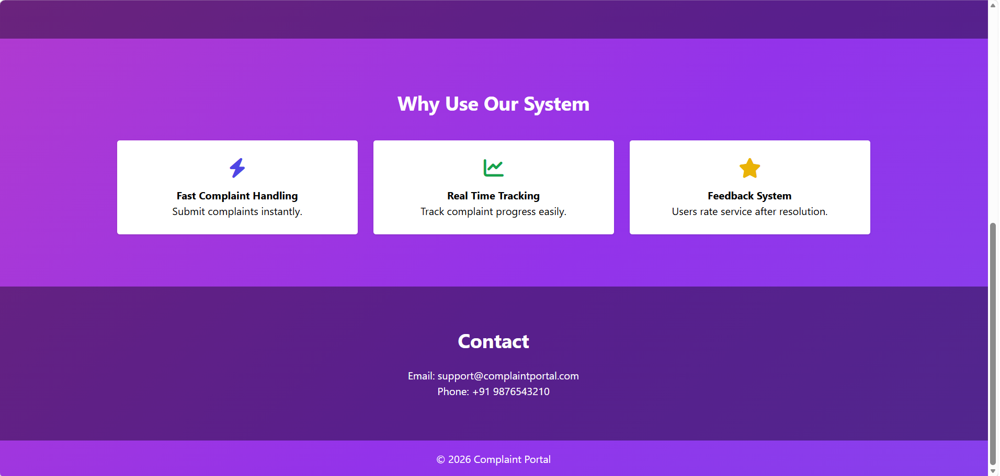
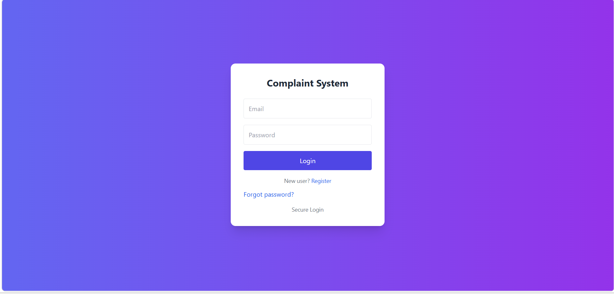
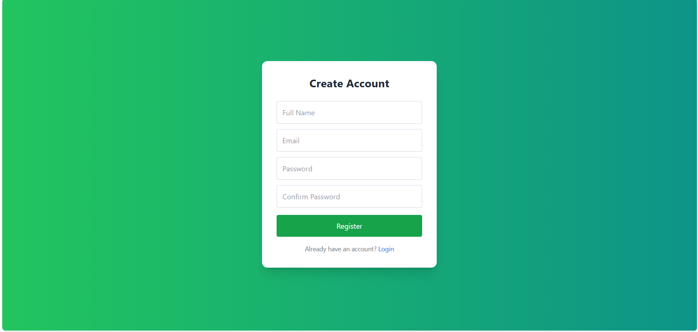
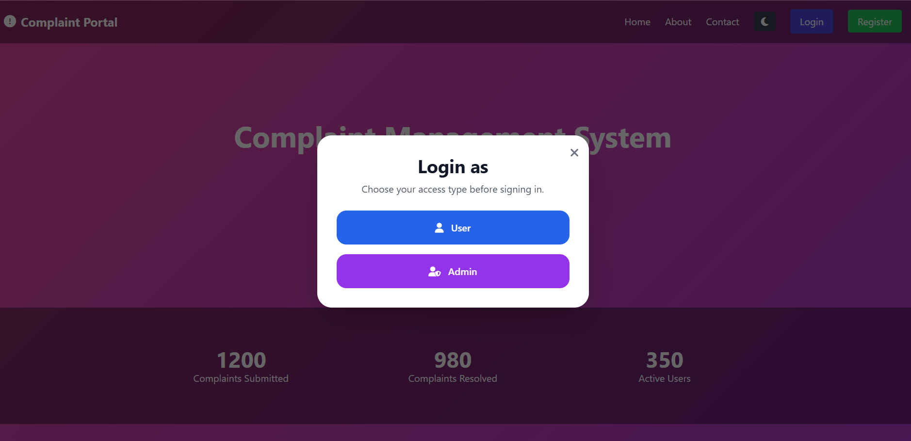
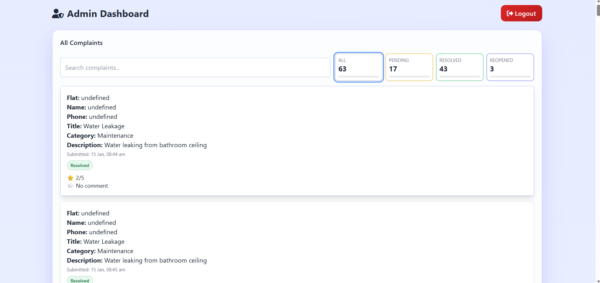
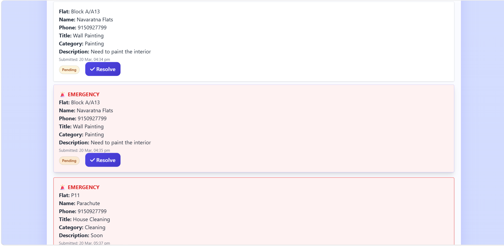
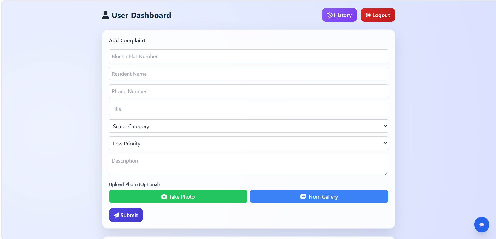
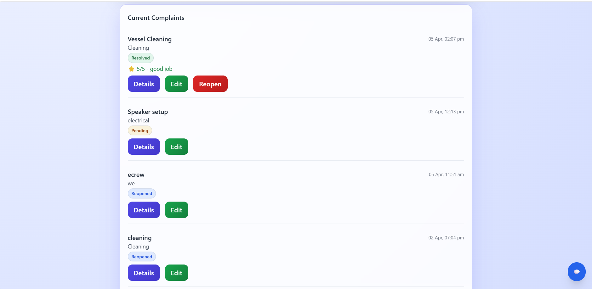
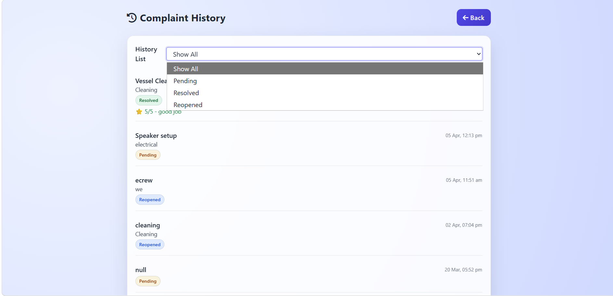

# Complaint Management System

## 📌 Overview
The Complaint Management System is a web-based application that enables users to register complaints, track their status, and allows administrators to manage and resolve issues efficiently.

---

## 🚀 Features
- User authentication (Register/Login)
- Admin authentication and dashboard
- Submit and manage complaints
- Track complaint status in real-time
- Image/file upload support
- Role-based access (User/Admin)

---

## 🛠️ Tech Stack
- Frontend: HTML, CSS, JavaScript
- Backend: Node.js, Express.js
- Database: MongoDB

---

## ⚙️ Installation & Setup

### 1. Clone the repository
```bash
git clone https://github.com/Pavi1104/Complaint-management-system.git
## 🔐 Environment Variables
Create a `.env` file inside the backend folder and add:
MONGO_URI=YOUR_MONGODB_URL
JWT_SECRET=YOUR_SECRET_KEY
OPENAI_API_KEY=YOUR_API_KEY_HERE
EMAIL_USER=YOUR_EMAIL
EMAIL_PASS=YOUR_PASSWORD
---

## 📸 Screenshots

### 🔹 Home Page


### 🔹 Home Page Details


### 🔹 Login Page


### 🔹 Register Page


### 🔹 Roles Selection


### 🔹 Admin Dashboard



### 🔹 User Dashboard



### 🔹 User History


## 👩‍💻 Author
Pavithra Lakshmi
